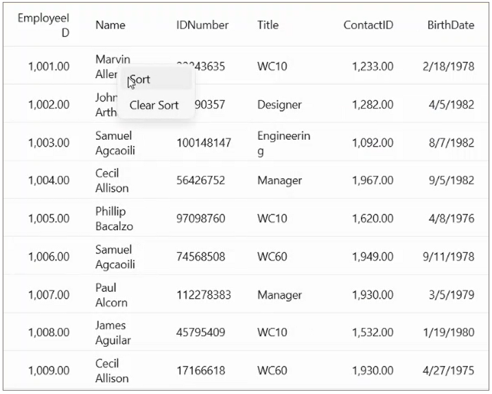

# How to show context menu in MAUI DataGrid ?
The [.NET MAUI DataGrid(SfDataGrid)](https://www.syncfusion.com/maui-controls/maui-datagrid) does not have built-in support for the context menu. 
However, you can achieve this by loading [FlyoutBase.ContextFlyout](https://learn.microsoft.com/en-us/dotnet/maui/user-interface/context-menu#create-context-menu-items) within a DataGrid and utilizing the CellRightTapped event. 

## XAML
Define your DataGrid with the required customizations. Embed the DataGrid with `FlyoutBase.ContextFlyout` containing your desired context menu items using `MenuFlyoutItem`.

```XML
<syncfusion:SfDataGrid  x:Name="dataGrid" 
            ItemsSource="{Binding Employees}" >
    <FlyoutBase.ContextFlyout>
        <MenuFlyout>
            <MenuFlyoutItem Text="Sort" 
                Command="{Binding SortCommand}" 
                CommandParameter="{x:Reference dataGrid}"  />
            <MenuFlyoutItem Text="Clear Sort" 
                Command="{Binding ClearSortCommand}" 
                CommandParameter="{x:Reference dataGrid}"  />
        </MenuFlyout>
    </FlyoutBase.ContextFlyout>
</syncfusion:SfDataGrid>
```

## C#
### MainPage.cs
Within the `DataGridCellRightTappedEventArgs` we will get the [RowColumnIndex](https://help.syncfusion.com/cr/maui/Syncfusion.Maui.GridCommon.ScrollAxis.RowColumnIndex.html) of the clicked [DataGridCell](https://help.syncfusion.com/cr/maui/Syncfusion.Maui.DataGrid.DataGridCell.html).
 
 ```C#
public partial class MainPage : ContentPage
{
    public MainPage()
    {
        InitializeComponent();
#if WINDOWS || MACCATALYST
        dataGrid.CellRightTapped += DataGrid_CellRightTapped;
#endif

    }

    private void DataGrid_CellRightTapped(object sender, DataGridCellRightTappedEventArgs e)
    {
        viewModel.currentColumnName = dataGrid.Columns[e.RowColumnIndex.ColumnIndex].MappingName;
    }        
}
 ```

### ViewModel.cs
In the ViewModel class create the necessary commands and logic to sort and unsort a [DataGridColumn](https://help.syncfusion.com/cr/maui/Syncfusion.Maui.DataGrid.DataGridColumn.html).
 ```C#
public class EmployeeViewModel
{
    public ICommand SortCommand { get; set; }
    public ICommand ClearSortCommand { get; set; }
    public string currentColumnName { get; set; }
    public EmployeeViewModel()
    {
        SortCommand = new Command(SortColumn);
        ClearSortCommand = new Command(ClearSort);
    }

    private void ClearSort(object sender)
    {
        var dataGrid = sender as SfDataGrid;
        if (dataGrid.SortColumnDescriptions.Count > 0)
            dataGrid.SortColumnDescriptions.Clear();
        else
            Application.Current.MainPage.DisplayAlert("Warning","Column not sorted","Ok");
    }

    private void SortColumn(object sender)
    {
        var dataGrid = sender as SfDataGrid;
        dataGrid.SortColumnDescriptions.Clear();
        dataGrid.SortColumnDescriptions.Add(new SortColumnDescription()
        {
            ColumnName = currentColumnName,
            SortDirection = ListSortDirection.Ascending,
        });

    }
}
 ```

The following screenshot shows the Context menu in SfDataGrid.



Take a moment to pursue this [documentation](https://help.syncfusion.com/maui/datagrid/overview), where you can find more about Syncfusion .NET MAUI DataGrid (SfDataGrid) with code examples.
Please refer to this [link](https://www.syncfusion.com/maui-controls/maui-datagrid) to learn about the essential features of Syncfusion .NET MAUI DataGrid(SfDataGrid).
### Conclusion
I hope you enjoyed learning about how to show Context menu in MAUI DataGrid (SfDataGrid).

You can refer to our [.NET MAUI DataGrid’s feature tour](https://www.syncfusion.com/maui-controls/maui-datagrid) page to know about its other groundbreaking feature representations. You can also explore our .NET MAUI DataGrid Documentation to understand how to present and manipulate data.
For current customers, you can check out our .NET MAUI components from the [License and Downloads](https://www.syncfusion.com/account/downloads) page. If you are new to Syncfusion, you can try our 30-day free trial to check out our .NET MAUI DataGrid and other .NET MAUI components.
If you have any queries or require clarifications, please let us know in comments below. You can also contact us through our [support forums](https://www.syncfusion.com/forums), [Direct-Trac](https://support.syncfusion.com/account/login?ReturnUrl=%2Faccount%2Fconnect%2Fauthorize%2Fcallback%3Fclient_id%3Dc54e52f3eb3cde0c3f20474f1bc179ed%26redirect_uri%3Dhttps%253A%252F%252Fsupport.syncfusion.com%252Fagent%252Flogincallback%26response_type%3Dcode%26scope%3Dopenid%2520profile%2520agent.api%2520integration.api%2520offline_access%2520kb.api%26state%3D8db41f98953a4d9ba40407b150ad4cf2%26code_challenge%3DvwHoT64z2h21eP_A9g7JWtr3vp3iPrvSjfh5hN5C7IE%26code_challenge_method%3DS256%26response_mode%3Dquery) or [feedback portal](https://www.syncfusion.com/feedback/maui?control=sfdatagrid). We are always happy to assist you!